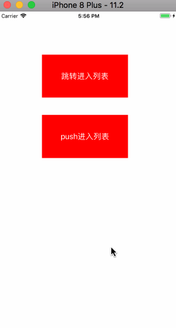
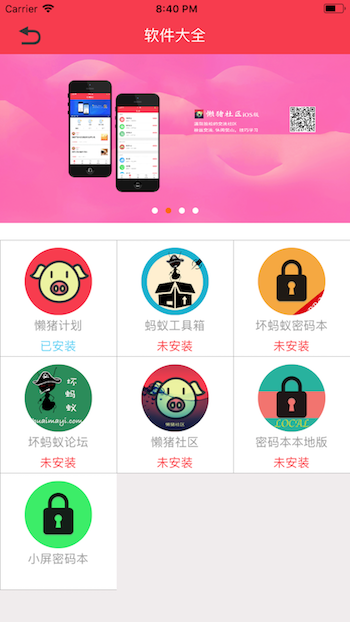

# HDAppListViewController

HDAppListViewController，可以快速设置app的列表，点击即可跳转到appstore的下载页面。可以监听点击列表和点击banner图片的回调

## 一、导入项目

该工具可以使用cocoapods导入，也可以通过下载源文件导入。

### 通过cocoapods导入

```
pod 'HDAppListViewController'
```
### 通过文件导入

下载项目，将项目文件下的`HDAppListViewController `文件夹里面的内容导入项目即可

## 二、函数使用

### 1、导入头文件 

```
#import "HDAppListViewController.h"
```
### 2、创建和设置对象

```
//创建list
HDAppListViewController *applistVC = [[HDAppListViewController alloc] init];
    
///添加list的对象
HDAppListItem *item = [[HDAppListItem alloc] initWithAppID:@"1354861951" withAppName:@"懒猪计划" withAppIcon:[UIImage imageNamed:@"lanzhu"]];
[applistVC addAppListItem:item];

///添加显示安装状态的对象，需要设置对应的scheme，并且在info中设置LSApplicationQueriesSchemes中添加这里对应的scheme才可以检测软件安装状态
HDAppListItem *item2 = [[HDAppListItem alloc] initWithAppID:@"1193575039" withAppName:@"蚂蚁工具箱" withAppIcon:[UIImage imageNamed:@"huaimayitool"] withScheme:@"huaimayilifeTool"];
[applistVC addAppListItem:item2];

//可以创建banner (可选，设置了会显示，不设置不显示)
NSURL *fileURL = [NSURL fileURLWithPath:[[NSBundle mainBundle] pathForResource:@"git" ofType:@"png"]];
HDBannerItem *bannerItem = [[HDBannerItem alloc] initWithBannerImgURL:fileURL];
[applistVC addBannerItem:bannerItem];

applistVC.appListClickCompleteHandler = ^(NSInteger index, HDAppListItem *applistItem) {
        NSLog(@"点击了列表页");
        if (applistItem.appID.length == 0) {
            [weakApplistVC dismissViewControllerAnimated:YES completion:nil];
        }
};
///通过网络图片创建banner
NSURL *url3 = [NSURL URLWithString:@"https://imgsrc.baidu.com/imgad/pic/item/eaf81a4c510fd9f900630df72f2dd42a2834a43c.jpg"];
HDBannerItem *bannerItem3 = [[HDBannerItem alloc] initWithBannerImgURL:url3];
[applistVC addBannerItem:bannerItem3];
    
applistVC.appBannerClickCompleteHandler = ^(NSInteger index, HDBannerItem *bannerItem) {
        NSLog(@"点击了banner");
        [[UIApplication sharedApplication] openURL:[NSURL URLWithString:@"http://www.lazypig.net"]];
};
```

### 3、可设置的属性

```
///在list设置的产品个数
@property (assign, nonatomic, readonly) NSInteger appListItemCount;
///在banner设置的产品个数
@property (assign, nonatomic, readonly) NSInteger appBannerItemCount;
///点击列表的list的回调
@property (copy, nonatomic) AppListClickCompleteHandler appListClickCompleteHandler;
///点击banner的回调
@property (copy, nonatomic) AppBannerClickCompleteHandler appBannerClickCompleteHandler;
///背景颜色
@property (strong, nonatomic) UIColor *listBackgroundColor;
///每个cell的背景色
@property (strong, nonatomic) UIColor *cellBackgroundColor;
///banner和list的间距，默认为20
@property (assign, nonatomic) float bannerDistance;
///icon图标的大小，默认为80
@property (assign, nonatomic) float iconImageWidth;
///标题颜色,默认为浅灰色
@property (strong,nonatomic) UIColor *titleColor;
///标题字体大小，默认为14
@property (assign,nonatomic) float titleFontSize;
///是否显示分割线,默认为YES
@property (assign, nonatomic) BOOL hasLine;
///分割线颜色,默认为浅灰色
@property (strong,nonatomic) UIColor *lineColor;
///分割线的宽度，默认为0.5
@property (assign,nonatomic) float lineWidth;
///点击list是否自动跳转到下载页，默认为YES
@property (assign, nonatomic) BOOL autoDownload;
```

## 三、效果演示




## 四、其他 Other

欢迎交流，互相学习

项目gitHub地址：[https://github.com/DamonHu/HDAppListViewController](https://github.com/DamonHu/HDAppListViewController)

我的博客：[http://www.hudongdong.com](http://www.hudongdong.com)
